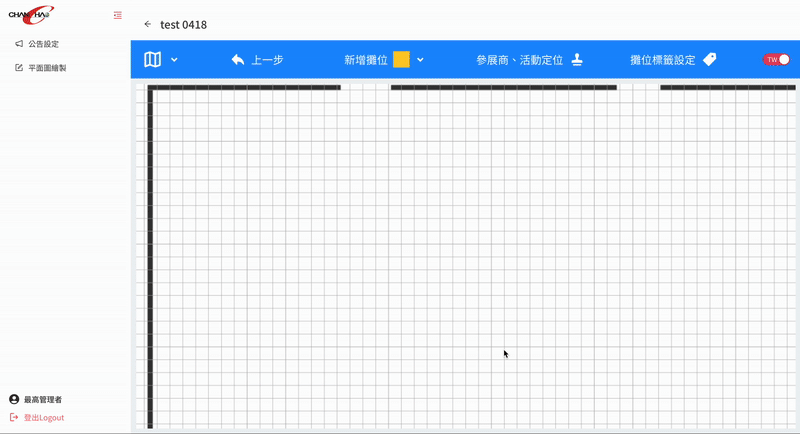
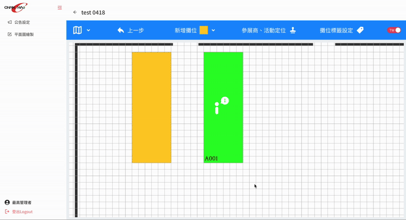
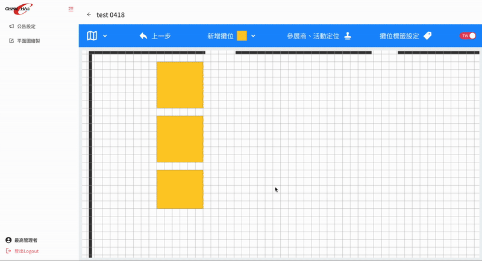
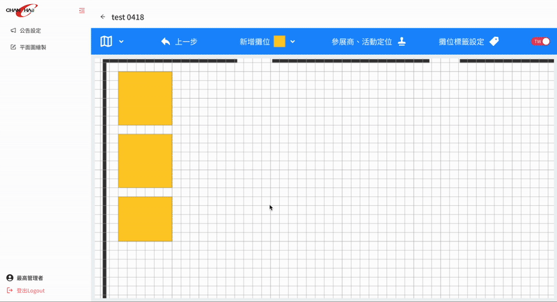
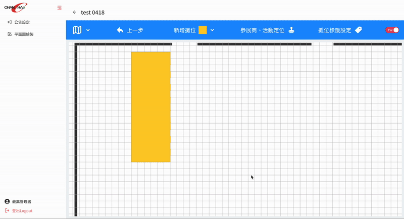

# 展昭國際 - 展覽場地平面圖系統

用於編輯與管理展場平面圖的工具，使用 PixiJS 與 React 開發。

## Tech Stack
- **Frontend:** React、React Router、MobX、Ant Design
- **Canvas Rendering:** PixiJS

## Interesting Challenges
- 在使用 PixiJS 管理互動元素的同時，保持與 MobX 狀態同步
- 處理複雜的 UI 邏輯，例如合併與撤銷 Canvas 操作
- 在繪製大型平面圖時確保效能表現

## Highlights
- 編輯功能僅供內部使用
- 可以在 APP 內使用預覽功能

## Demo GIFs

### Add Booth
- 使用 PixiJS Graphics API 即時繪製攤位矩形, 支援滑鼠拖移調整大小
- 實作 AABB（軸對齊邊界盒）觸碰檢測, 防止攤位重疊創建
- 透過 MobX 管理創建模式的切換, 確保 UI 狀態與 Canvas 操作同步

### Copy Booth
- 實作攤位資料的深層複製, 包含圖形資訊、參展商資料、樣式設定
- 建立記憶體中的剪貼簿系統, 使用右鍵菜單複製與貼上
- 貼上時自動計算適當的位置偏移, 貼齊網格, 且避免與原攤位完全重疊
- 支援多選攤位的批量複製, 提升編輯效率

### Delete Booth
- 透過 PixiJS InteractionManager 處理攤位選擇, 支援單選和多選模式
- 刪除攤位時自動清理關聯的參展商資料、標籤資訊
- 刪除前的選中效果, 使用 PixiJS filters 實現邊框發光

### Edit Booth
- 編輯攤位屬性時, Canvas 中的攤位即時更新顏色、文字、標籤
- 使用 Ant Design Form 組件, 結合自定義驗證規則確保資料完整性
- MobX computed 屬性確保表單資料與 Canvas 物件狀態同步
- 支援中英文攤位編號和參展商名稱的動態切換顯示

### Merge Booths
- 計算多個攤位的聯集邊界, 生成合併後攤位的最小外接矩形
- 合併參展商清單、標籤集合, 處理重複資料的去重邏輯

### Move Booth
- 實作自定義 DragObject 類別, 處理攤位的平滑拖拽移動
- 拖拽過程中即時檢測與其他攤位的碰撞
- 處理螢幕座標與 Canvas 世界座標的轉換, 支援縮放和平移狀態

### Undo
- 每個操作封裝為 Command 物件, 包含 execute 和 undo 方法
- 使用 JSON 深拷貝保存操作前的完整狀態, 確保回滾的準確性
- 不同類型操作（創建、移動、刪除）使用不同的回滾策略

### Results
- 支援 SVG 向量格式和高解析度 JPG 匯出
- 選擇中文或英文版本的平面圖匯出, 自動切換文字內容

