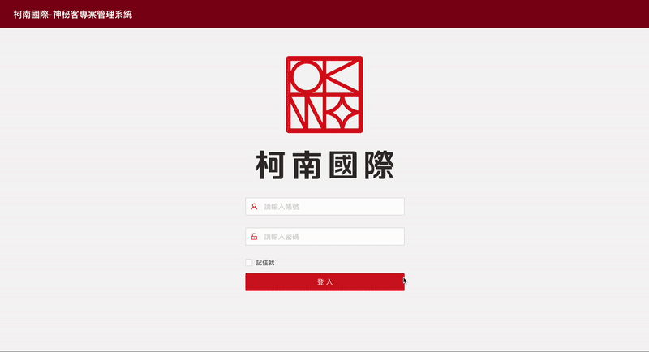
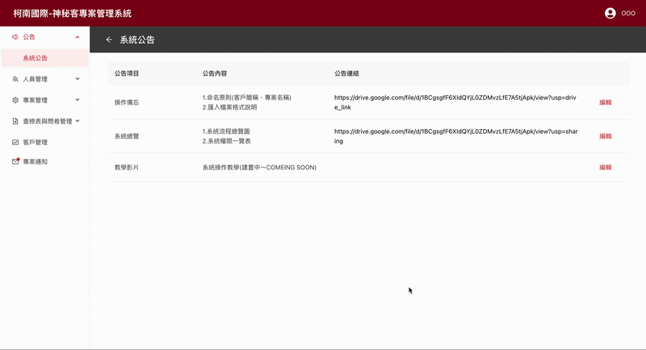
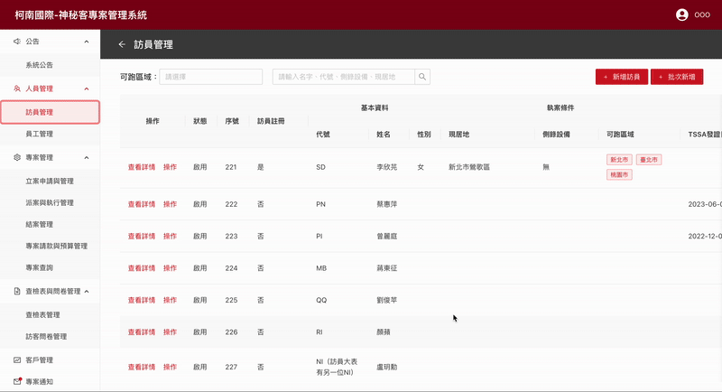
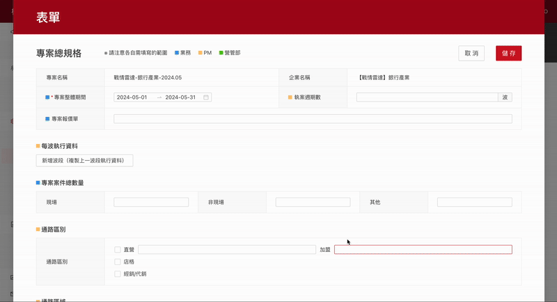
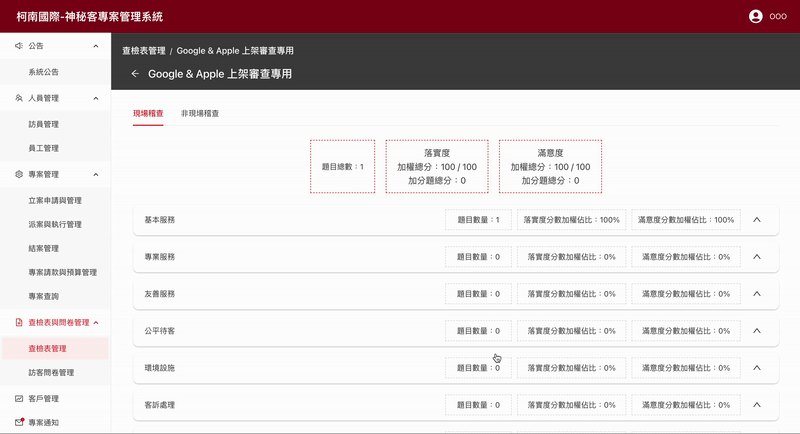
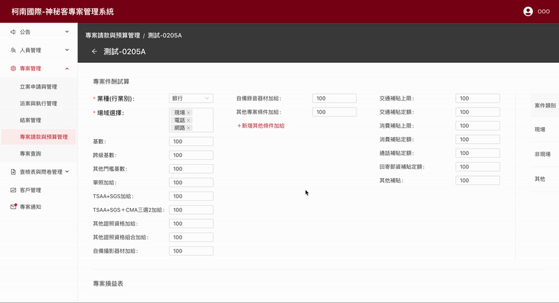
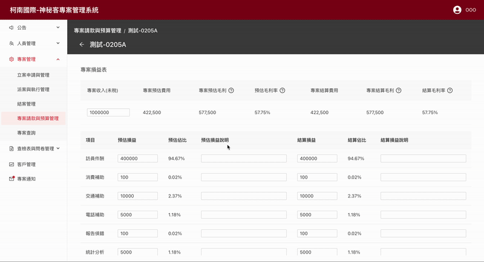

# Conan Admin Dashboard

An internal dashboard system built with React, designed for managing complex forms and backend data.

## Tech Stack
- React
- React Router
- MobX
- Ant Design

## Highlights
- Form-heavy UI with computed properties optimization
- Data-heavy interface handling
- Internal-use-only project

## Demo GIFs

### Login

### Menu

### Visitors

### Format Item

### Check List

### Budget

