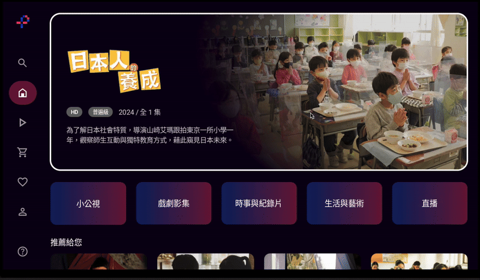
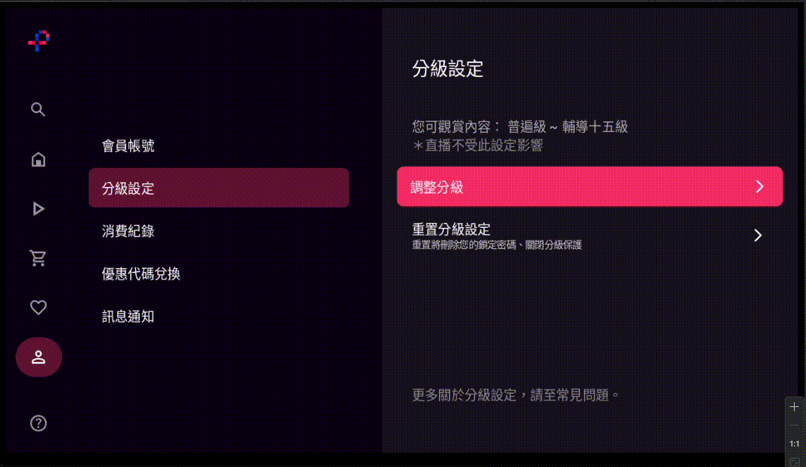
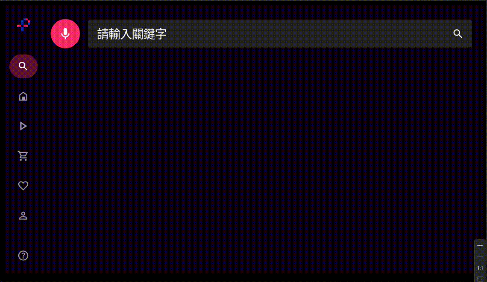

# [PTS TV App](https://play.google.com/store/apps/details?id=com.pts.ptsplus&hl=zh_TW&pli=1)

PTSTV 是專為[公共電視台 (PTS)](https://www.pts.org.tw/) 開發的 Android TV 應用程式, 旨在為 Android TV 設備提供完美的觀看體驗。

## 技術
- **開發語言:** Kotlin  
- **UI 工具** Jetpack Compose  
- **目標平台:** Android TV  

## 特色
- 適配各種電視螢幕尺寸
- 針對 TV 遙控器的導航體驗
- 自訂響應式焦點行為
- API 錯誤捕捉與自動重試機制

## Demo GIFs

### Home
- Banner 自適應加載狀態管理, 支援多種內容類型（節目、直播、行銷標籤）
- 使用自定義 Paging 系統, 支援無限滾動載入更多內容
- 網格焦點狀態的自動記錄與恢復焦點
- 登入狀態的個人化推薦內容

### Menu
- 自訂動畫與 Z 軸深度佈局效果
- 根據登入狀態動態顯示不同項目
- 選中狀態的視覺回饋系統

### Rating
- 密碼驗證 → 分級設定的完整流程
- 4位數字驗證碼輸入, 支援自動焦點切換
- 基於 Compose BasicTextField 的自定義封裝元件

### Search
- 麥克風權限檢查與語音辨識整合
- 節目與直播搜尋結果的分類顯示
- 搜尋時自動禁用選單，優化用戶體驗

### Program
- 節目詳情頁 ↔ 季數選擇頁的無縫切換
- 地區版權、認證狀態、分級限制等檢查
- 解決巢狀捲動衝突的三層焦點控制
- Tab 切換式的節目介紹、集數列表、預告片段
- 登入、分級、下架等多種情境的警告

### Player
- ExoPlayer (Media3)
- 支援播放 HLS(m3u8), DRM(mpd), Livestream
- 完全自定義的播放控制 UI
- 方向鍵導航 (WatchEventBlock)、返回事件處理
- 播放控制 (播放/暫停/快進/快退)
- 時間軸、字幕語系調整、語音語系調整、解析度調整

